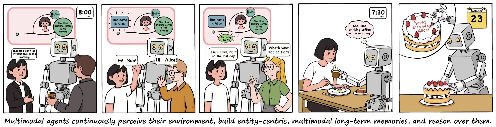
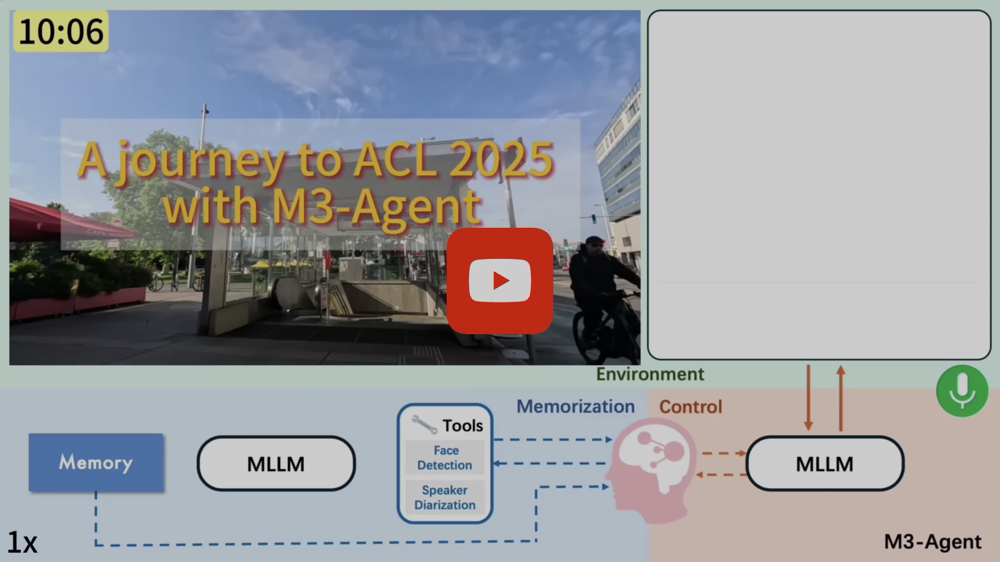
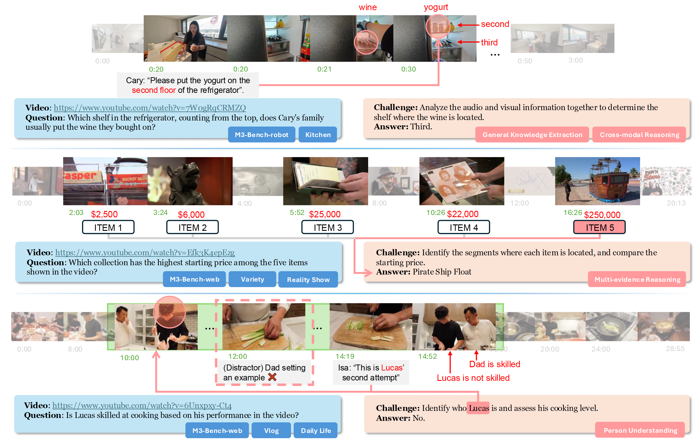
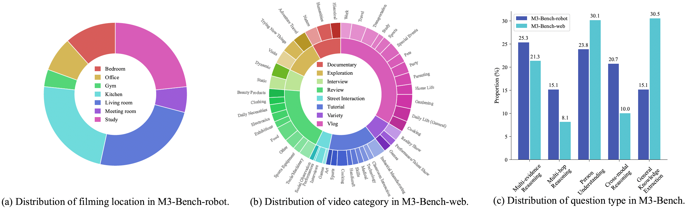
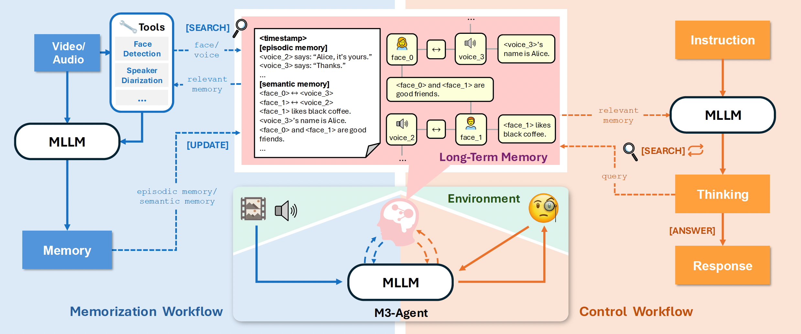
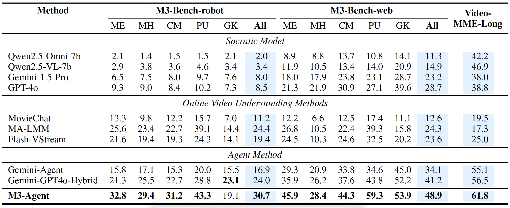

<div align=left>
    
</div>

<h1 style="text-align: center;">Seeing, Listening, Remembering, and Reasoning: A Multimodal Agent with Long-Term Memory</h1>

[](https://arxiv.org/abs/2508.09736)
[](https://m3-agent.github.io)
[](https://huggingface.co/ByteDance-Seed/M3-Agent-Memorization)
[](https://huggingface.co/ByteDance-Seed/M3-Agent-Control)
[](https://huggingface.co/datasets/ByteDance-Seed/M3-Bench)

## Abstract

We introduce M3-Agent, a novel multimodal agent framework equipped with long-term memory. Like humans, M3-Agent can process real-time visual and auditory inputs to build and update its long-term memory. Beyond episodic memory, it also develops semantic memory, enabling it to accumulate world knowledge over time. Its memory is organized in an entity-centric, multimodal format, allowing deeper and more consistent understanding of the environment. Given an instruction, M3-Agent autonomously performs multi-turn, iterative reasoning and retrieves relevant information from memory to accomplish the task. To evaluate memory effectiveness and memory-based reasoning in multimodal agents, we develop M3-Bench, a new long-video question answering benchmark. M3-Bench comprises 100 newly recorded real-world videos captured from a robot’s perspective (M3-Bench-robot) and 920 web-sourced videos across diverse scenarios (M3-Bench-web). We annotate question-answer pairs designed to test key capabilities essential for agent applications, such as human understanding, general knowledge extraction, and cross- modal reasoning. Experimental results show that M3-Agent, trained via reinforcement learning, outperforms the strongest baseline, a prompting agent using Gemini-1.5-pro and GPT-4o, achieving 8.2%, 7.7%, and 5.3% higher accuracy on M3-Bench-robot, M3-Bench-web and VideoMME-long, respectively. Our work advances the multimodal agents toward more human-like long-term memory and provides insights into their practical design.



## A demo of M3-Agent as a personal assistant!

[](https://www.youtube.com/watch?v=XUx31cBanfo)

The video can also be accessed on [Bilibili](https://www.bilibili.com/video/BV1h9YpznEx9/)

## M3-Bench

We introduce M3-Bench, an long video question answerin dataset designed to evaluate the capability of multimodal agents to perform reasoning over long-term memory. Each instance in M3-Bench comprises a long video simulating the perceptual input of an agent, along with a series of open-ended question-answer pairs. The dataset is organized into two subsets:
1. M3-Bench-robot, which contains 100 real-world videos recorded from a robot's first-person perspective, 
2. M3-Bench-web, which includes 920 web-sourced videos covering a wider variety of content and scenarios. 

\
[link1](https://www.youtube.com/watch?v=7W0gRqCRMZQ), [link2](https://www.youtube.com/watch?v=Efk3K4epEzg), [link3](https://www.youtube.com/watch?v=6Unxpxy-Ct4)\
Examples from M3-Bench. M3-Bench-robot features long videos from realistic robotic work scenarios, while M3-Bench-web expands the video diversity to support broader evaluation. The question-answering tasks are designed to assess a multimodal agent’s ability to construct consistent and reliable long-term memory, as well as to reason effectively over that memory.



Statistical overview of M3-Bench benchmark. Each question may correspond to multiple question types.

### Videos

1. Download M3-Bench-robot from [huggingface](https://huggingface.co/datasets/ByteDance-Seed/M3-Bench/tree/main/videos/robot)
2. Download M3-Bench-web from video_url in `data/annotations/web.json`\

### Intermediate Outputs

**[optional]** You can either download the intermediate outputs we have processed from [huggingface](https://huggingface.co/datasets/ByteDance-Seed/M3-Bench/tree/main/intermediate_outputs) or generate them directly from the video by the following steps.

### Memory Graphs

**[optional]** You can either download and extract the memory graphs we have processed from [huggingface](https://huggingface.co/datasets/ByteDance-Seed/M3-Bench/tree/main/memory_graphs) or generate them directly from the video by the following steps.

## M3-Agent



Architecture of M3-Agent. The system consists of two parallel processes: memorization and control. During memorization, M3-Agent processes video and audio streams online to generate episodic and semantic memory. During control, it executes instructions by iteratively thinking and retrieving from long-term memory. The long-term memory is structured as a multimodal graph.

## Experimental Results



Results on M3-Bench-robot, M3-Bench-web, and VideoMME-long.

## Run Locally

> Before running, add api config in `configs/api_config.json`

### Memorization

Generate memory graphs for each video. The results are saved in `data/memory_graphs`.

- The following steps are required only if you haven't downloaded *intermediate_outputs* and *memory_graphs* from huggingface or want to process other videos not from M3-Bench.

1. Set up environment

```bash
bash setup.sh
pip install git+https://github.com/huggingface/transformers@f742a644ca32e65758c3adb36225aef1731bd2a8
pip install qwen-omni-utils==0.0.4
```

2. Cut Video

   Cut the video into 30 second segments.

```bash
#!/bin/bash

video="robot/bedroom_01"
input="data/videos/$video.mp4"
mkdir -p "data/clips/$video"
duration=$(ffprobe -v error -show_entries format=duration -of default=noprint_wrappers=1:nokey=1 "$input")
duration_seconds=$(echo "$duration" | awk '{print int($1)}')
 
segments=$((duration_seconds / 30 + 1))
for ((i=0; i<segments; i++)); do
    start=$((i * 30))
    end=$(((i + 1) * 30))
    output="data/clips/$video/$i.mp4"
    ffmpeg -ss $start -i "$input" -t 30 -c copy "${output}"
done
```

3. Prepare data

Prepare a jsonl file with one video per line saved in `data/data.jsonl`

```json
{"id": "bedroom_01", "video_path": "data/videos/robot/bedroom_01.mp4", "clip_path": "data/videos/clips/bedroom_01", "mem_path": "data/videos/memory_graphs/bedroom_01.pkl", "intermediate_path": "data/videos/intermediate_outputs/robot/bedroom_01"}
```


4. Generate Intermediate Outputs

   **This step uses Face Detection and Speaker Diarization tools to generate intermediate outputs.**

   - If you want to use M3-Bench and have downloaded intermediate_outputs from huggingface, you can skip this step.

   - Download audio embedding model and save into `models\` from [pretrained_eres2netv2.ckpt](https://www.modelscope.cn/models/iic/speech_eres2netv2_sv_zh-cn_16k-common/resolve/master/pretrained_eres2netv2.ckpt)

   - Download [speakerlab](https://github.com/modelscope/3D-Speaker/tree/main/speakerlab)

   ```
   m3-agent
   ├── models
   │   └── pretrained_eres2netv2.ckpt
   └── speakerlab
   ```

```bash
python m3_agent/memorization_intermediate_outputs.py \
   --data_file data/data.jsonl
```

5. Generate Memory Graphs

   **This step uses the M3-Agent-Memorization model to generate memory graphs.**

   - Download M3-Agent-Memorization from [huggingface](https://huggingface.co/ByteDance-Seed/M3-Agent-Memorization)

```bash
python m3_agent/memorization_memory_graphs.py \
   --data_file data/data.jsonl
```

6. Memory Graph Visualization

```bash
python visualization.py \
   --mem_path data/memory_graphs/robot/bedroom_01.pkl \
   --clip_id 1
```

### Control

1. Set up environment

```bash
bash setup.sh
pip install transformers==4.51.0
pip install vllm==0.8.4
pip install numpy==1.26.4
```

2. Question Answering and Evaluation

   **This step uses the M3-Agent-Control model to generate answer and the GPT-4o to evaluate the answer.**

   - Download M3-Agent-Control from [huggingface](https://huggingface.co/ByteDance-Seed/M3-Agent-Control)

```bash
python m3_agent/control.py \
   --data_file data/annotations/robot.json
```

### Other Models

If you want to prompt other models to generate memory or answer question, only need to change the model inference into api calling and use the corresponding prompt.

Prompts:

1. Memorization
   - Gemini/GPT-4o: `mmagent.prompts.prompt_generate_captions_with_ids`
   - Qwen2.5-Omni-7B: `mmagent.prompts.prompt_generate_full_memory`

2. Control
   - GPT-4o: `mmagent.prompts.prompt_answer_with_retrieval_final`


## Training

1. Memorization: https://github.com/hyc2026/sft-qwen2.5-omni-thinker
2. Control: https://github.com/hyc2026/M3-Agent-Training

## Citation
Please cite us as:

```BibTeX
@misc{long2025seeing,
      title={Seeing, Listening, Remembering, and Reasoning: A Multimodal Agent with Long-Term Memory}, 
      author={Lin Long, Yichen He, Wentao Ye, Yiyuan Pan, Yuan Lin, Hang Li, Junbo Zhao, Wei Li},
      year={2025},
      eprint={2508.09736},
      archivePrefix={arXiv},
      primaryClass={cs.CV}
}
```
